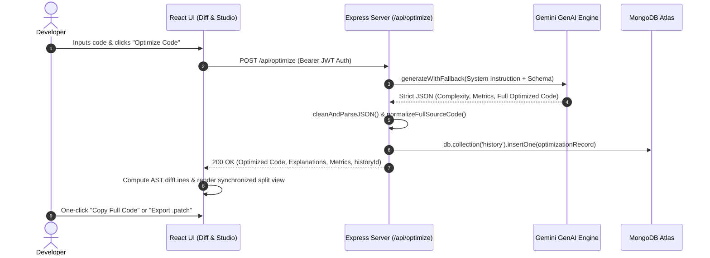

# ⚡ AI Code Performance & Optimization Studio

<div align="center">


<p align="center">
  <b>Full-stack AI developer platform for automated code optimization, asymptotic complexity analysis, design pattern refactoring, persistent user accounts (MongoDB Atlas), and interactive side-by-side diff verification.</b>
</p>

[Architecture](#-system-architecture) • [Workflow](#-system-workflow) • [Key Features](#-features) • [Deploy on Render](#-deploy-to-render) • [MongoDB Setup](#-mongodb-atlas-configuration)

</div>

---

## 📖 Overview

**AI Code Performance & Optimization Studio** is a production-ready full-stack developer acceleration platform. It analyzes code snippets, detects asymptotic complexity bottlenecks ($O(N^2) \to O(N)$), benchmarks multi-scale execution time, and provides full, runnable optimized implementations.

User accounts, sessions, and past optimizations are permanently persisted to **MongoDB Atlas** (with an automatic in-memory fallback for local prototyping).

---

## ✨ Features

- **🚀 Algorithmic Optimization Engine:** Transforms brute-force algorithms, unoptimized nested loops, and memory-leaking routines into high-performance, idiomatic code.
- **📊 Algorithmic Profiling & Metrics:**
  - Before vs. After **Time Complexity** (e.g. $O(N^2) \to O(N \log N)$)
  - Before vs. After **Space Complexity** (e.g. $O(N) \to O(1)$)
  - Estimated **Execution Speedup Factor** & Readability Score ratings (1–10).
- **🔒 Persistent User Accounts & Authentication:**
  - Secure bcrypt password hashing and signed JWT sessions.
  - Multi-user data isolation and history tracking with **MongoDB Atlas**.
- **🔍 Interactive Side-by-Side Diff Viewer:**
  - Synchronized scrolling between original and optimized code.
  - Granular addition, deletion, and line modification tracking.
  - Dedicated **Split View**, **Unified View**, and **Optimized Only** layout modes.
  - One-click full-source clipboard copy and file downloading.
- **🛠️ Automated Architectural Refactor Studio:** Target custom architectural refactor patterns including:
  - *Loops to Declarative Functional Pipelines*
  - *Guard Clauses & Early Returns*
  - *Strategy Pattern & Dispatch Tables*
  - *Builder & Fluent Pipelines*
  - *Memoization & Caching*
  - *Immutability & Pure Functions*
- **📈 Multi-Scale Benchmark Simulation:** Simulates runtime latency comparisons across input scales from $N = 100$ to $N = 1,000,000$.
- **🧠 Interactive Coding & Optimization Quizzes:** Integrated knowledge assessment modules to test algorithmic concepts across Python, TypeScript, Java, C++, Go, and Rust.
- **📦 Multi-Format Export:** Instant export to `.patch` (Git unified diff), `.md` (Performance Audit Report), `.json` (Full Dataset), and raw source code files.
- **💾 Session & Cloud History:** Persistent tracking and instant retrieval of previous optimizations.

---

## 🛠️ Tech Stack

<div align="center">

| Layer | Technologies |
|---|---|
| **Frontend UI** |     |
| **Icons & Syntax** |    |
| **Backend & DB** |     |
| **AI Core** |  |
| **Charts & Data** |   |
| **Hosting** |  |

</div>

---

## 🏗️ System Architecture

```
┌─────────────────────────────────────────────────────────────────────────┐
│                           Client (React 18 SPA)                         │
│                                                                         │
│   ┌─────────────────────┐  ┌────────────────────┐  ┌────────────────┐  │
│   │ Code Input & Preset │  │ Synchronized Diff  │  │ Complexity &   │  │
│   │ Language Selectors  │  │ & Syntax Viewer    │  │ Benchmark Viz  │  │
│   └──────────┬──────────┘  └──────────▲─────────┘  └───────▲────────┘  │
└──────────────┼────────────────────────┼────────────────────┼────────────┘
               │ JSON Payload           │ Full Source Code   │
               ▼                        │ & Metrics          │
┌────────────────────────────────────────────────────────────┴────────────┐
│                    API Gateway & Node.js / Express Server               │
│                                                                         │
│   ┌─────────────────────┐  ┌────────────────────┐  ┌────────────────┐  │
│   │ Auth & Session Guard│  │ Prompt Engineering │  │ Clean & Parse  │  │
│   │ JWT Bearer Verify   │  │ & Schema Enforcer  │  │ JSON Pipeline  │  │
│   └──────────┬──────────┘  └──────────┬─────────┘  └───────▲────────┘  │
└──────────────┼────────────────────────┼────────────────────┼────────────┘
               │ Secure Gemini Request  │ Structured Output  │
               ▼                        ▼                    │
┌───────────────────────────────┐     ┌──────────────────────────────────┐
│   Google Gemini AI Cluster    │     │      MongoDB Atlas Database      │
│                               │     │                                  │
│ • gemini-3.7-flash (Primary)  │     │ • users (auth & bcrypt hashes)   │
│ • Dynamic Fallback Resolvers  │     │ • history (optimizations & diff) │
│ • Structured JSON Generation  │     │ • quiz_scores (assessments)      │
└───────────────────────────────┘     └──────────────────────────────────┘
```

---

## 🔄 System Workflow



---

## 🍃 MongoDB Atlas Configuration

1. Create a free **M0 Cluster** at [mongodb.com/atlas](https://www.mongodb.com/atlas).
2. Under **Security > Database Access**, create a database user and password.
3. Under **Security > Network Access**, click **Add IP Address** $\to$ **Allow Access from Anywhere (`0.0.0.0/0`)** (required for cloud hosting like Render).
4. Under **Clusters > Connect > Drivers**, copy the connection string:
   ```env
   MONGODB_URI=mongodb+srv://<username>:<password>@cluster0.abcde.mongodb.net/code_optimizer?retryWrites=true&w=majority
   MONGODB_DB_NAME=code_optimizer
   ```
   The app uses the `code_optimizer` database by default. If the URI does not include a database name, set `MONGODB_DB_NAME` explicitly in Render. The database user must have read/write access to this database.

---

## 🚀 Deploy to Render

### Option 1: 1-Click Blueprint (Using `render.yaml`)

1. Push your repository to **GitHub**.
2. Go to [Render Dashboard](https://dashboard.render.com/) $\to$ Click **New +** $\to$ **Blueprint**.
3. Connect your repository.
4. Set your `GEMINI_API_KEY` and `MONGODB_URI` environment variables and click **Apply**.

---

### Option 2: Manual Web Service Setup

1. In [Render Dashboard](https://dashboard.render.com/), click **New +** $\to$ **Web Service**.
2. Connect your GitHub repository.
3. Configure the settings:
   - **Language:** `Node`
   - **Build Command:** `npm install && npm run build`
   - **Start Command:** `npm run start`
   - **Plan:** `Free`
4. Add the following **Environment Variables**:

| Key | Value | Description |
|---|---|---|
| `GEMINI_API_KEY` | `your_gemini_api_key` | Secret key from [Google AI Studio](https://aistudio.google.com/) |
| `MONGODB_URI` | `mongodb+srv://...` | MongoDB Atlas cluster connection string |
| `MONGODB_DB_NAME` | `code_optimizer` | Optional database name; defaults to `code_optimizer` |
| `JWT_SECRET` | `a_secure_random_string` | Secret for signing user authentication tokens |
| `NODE_ENV` | `production` | Enables production bundle and static serving |

5. Click **Create Web Service**. Your app will build and go live on your Render URL!

---

## 💻 Local Development

### 1. Install dependencies
```bash
npm install
```

### 2. Setup `.env` file
```env
PORT=3000
GEMINI_API_KEY=your_gemini_api_key
MONGODB_URI=mongodb+srv://<user>:<password>@cluster0.mongodb.net/code_optimizer?retryWrites=true&w=majority
JWT_SECRET=your_local_jwt_secret
```

### 3. Run development server
```bash
npm run dev
```
Open `http://localhost:3000` in your browser.

---

## 🛡️ Security & Best Practices

- **Zero Client Key Leaks:** `GEMINI_API_KEY` and `MONGODB_URI` are server-only secrets and are never exposed in browser JavaScript bundles.
- **Bcrypt Password Security:** User passwords are never saved in plaintext; passwords are salted and hashed with 10 salt rounds.
- **Development Fallback:** When running locally without `MONGODB_URI`, the app may use in-memory storage for development. In production, or whenever `MONGODB_URI` is configured, signup and login fail clearly if MongoDB is unavailable or a user cannot be persisted; the app never reports a non-persisted account as a successful Atlas account.

---

## 📄 License

Distributed under the **MIT License**.

