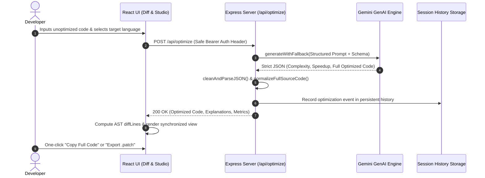

# ⚡ AI Code Performance & Optimization Studio

<div align="center">


<p align="center">
  <b>High-performance AI engine for automated code optimization, asymptotic complexity analysis, architectural refactoring, and interactive side-by-side diff verification.</b>
</p>

[Live Preview](https://ais-pre-carec2f2ogumkvexpxnv5t-170264886081.asia-southeast1.run.app) • [Architecture](#-system-architecture) • [Workflow](#-system-workflow) • [Key Features](#-features) • [Deployment](#-deployment-guide)

</div>

---

## 📖 Overview

**AI Code Performance & Optimization Studio** is a full-stack developer acceleration platform that analyzes arbitrary code snippets, uncovers asymptotic performance bottlenecks ($O(N^2) \to O(N)$), computes precise algorithmic time/space metrics, and generates complete, production-ready optimized implementations.

Developers can inspect line-by-line modifications via a synchronized side-by-side Diff Viewer, simulate execution scalability across large data bounds, and export patch files or comprehensive performance audit reports.

---

## ✨ Features

- **🚀 Algorithmic Optimization Engine:** Transforms brute-force algorithms, unoptimized nested loops, and memory-leaking routines into high-performance, idiomatic code.
- **📊 Algorithmic Profiling & Metrics:**
  - Before vs. After **Time Complexity** (e.g. $O(N^2) \to O(N \log N)$)
  - Before vs. After **Space Complexity** (e.g. $O(N) \to O(1)$)
  - Estimated **Execution Speedup Factor** & Readability Score ratings (1–10).
- **🔍 Interactive Side-by-Side Diff Viewer:**
  - Synchronized scrolling between original and optimized code.
  - Granular addition, deletion, and line modification tracking.
  - Dedicated **Split View**, **Unified View**, and **Optimized Only** layout modes.
  - One-click full-source clipboard copy and file downloading.
- **🛠️ Automated Architectural Refactor Studio:** Target custom architectural refactor patterns including:
  - *Clean Architecture & Modularization*
  - *Concurrency & Asynchronous Non-blocking Execution*
  - *Memory Allocation & Garbage Collection Reduction*
  - *Functional Paradigm Transformation*
- **📈 Multi-Scale Benchmark Simulation:** Simulates runtime latency comparisons across input scales from $N = 100$ to $N = 1,000,000$.
- **🧠 Interactive Coding & Optimization Quizzes:** Integrated knowledge assessment modules to test algorithmic concepts across Python, TypeScript, Java, C++, Go, and Rust.
- **📦 Multi-Format Export:** Instant export to `.patch` (Git unified diff), `.md` (Performance Audit Report), `.json` (Full Dataset), and raw source code files.
- **💾 Session & Cloud History:** Persistent tracking and instant retrieval of previous optimizations.

---

## 🛠️ Tech Stack

<div align="center">

| Layer | Technologies |
|---|---|
| **Frontend UI** |     |
| **Icons & Syntax** |    |
| **Backend Service** |    |
| **AI Core** |  |
| **Charts & Data** |   |
| **Deployment** |   |

</div>

---

## 🏗️ System Architecture

```
┌─────────────────────────────────────────────────────────────────────────┐
│                           Client (React 18 SPA)                         │
│                                                                         │
│   ┌─────────────────────┐  ┌────────────────────┐  ┌────────────────┐  │
│   │ Code Input & Preset │  │ Synchronized Diff  │  │ Complexity &   │  │
│   │ Language Selectors  │  │ & Syntax Viewer    │  │ Benchmark Viz  │  │
│   └──────────┬──────────┘  └──────────▲─────────┘  └───────▲────────┘  │
└──────────────┼────────────────────────┼────────────────────┼────────────┘
               │ JSON Payload           │ Full Source Code   │
               ▼                        │ & Metrics          │
┌────────────────────────────────────────────────────────────┴────────────┐
│                    API Gateway & Node.js / Express Server               │
│                                                                         │
│   ┌─────────────────────┐  ┌────────────────────┐  ┌────────────────┐  │
│   │ Auth & Session Guard│  │ Prompt Engineering │  │ Clean & Parse  │  │
│   │ getSafeAuthHeaders  │  │ & Schema Enforcer  │  │ JSON Pipeline  │  │
│   └──────────┬──────────┘  └──────────┬─────────┘  └───────▲────────┘  │
└──────────────┼────────────────────────┼────────────────────┼────────────┘
               │ Secure Internal Request│ Streaming Response │
               ▼                        ▼                    │
┌────────────────────────────────────────────────────────────┴────────────┐
│                 Google Gemini Generative AI Model Cluster               │
│                                                                         │
│     • gemini-3.7-flash (Primary Compiler Engine)                        │
│     • gemini-3.1-flash-lite / gemini-flash-latest (Dynamic Fallback)    │
│     • Strict Structured JSON Output Validation                          │
└─────────────────────────────────────────────────────────────────────────┘
```

---

## 🔄 System Workflow



---

## 🚀 Quickstart & Local Development

### Prerequisites
- **Node.js**: `v18.0.0` or higher
- **npm** or **yarn** or **pnpm**
- **Gemini API Key**: Obtainable from [Google AI Studio](https://aistudio.google.com/)

### 1. Clone the repository
```bash
git clone https://github.com/your-username/ai-code-optimizer-studio.git
cd ai-code-optimizer-studio
```

### 2. Install dependencies
```bash
npm install
```

### 3. Setup environment variables
Create a `.env` file in the root directory:
```env
# Server Port (Defaults to 3000)
PORT=3000

# Google Gemini AI Secret Key (Server-side only)
GEMINI_API_KEY=your_gemini_api_key_here
```

### 4. Run development server
```bash
npm run dev
```
Open your browser at `http://localhost:3000` to interact with the application.

---

## 📦 Build & Production

To compile both client-side static assets and the self-contained server bundle:

```bash
npm run build
```

To start the production server:
```bash
npm run start
```

---

## 🐳 Docker & Cloud Deployment

### Build Docker Container
```bash
docker build -t ai-code-optimizer:latest .
```

### Run Docker Container
```bash
docker run -d -p 3000:3000 -e GEMINI_API_KEY="your_api_key" --name code-optimizer ai-code-optimizer:latest
```

### Deploy to Google Cloud Run
```bash
gcloud run deploy ai-code-optimizer \
  --source . \
  --platform managed \
  --region us-central1 \
  --allow-unauthenticated \
  --set-env-vars GEMINI_API_KEY="your_api_key"
```

---

## 🛡️ Security & Best Practices

- **Zero Client API Key Leaks:** The `GEMINI_API_KEY` is strictly accessed within server-side Express handlers and is never packaged in client-side bundles.
- **Sanitized Auth & Headers:** Requests utilize `getSafeAuthHeaders()` to prevent malformed bearer strings from causing unexpected token errors.
- **Safe Parsing Engine:** All AI responses pass through `cleanAndParseJSON` to strip rogue markdown formatting before state ingestion.

---

## 📄 License

Distributed under the **MIT License**. See `LICENSE` for more information.
